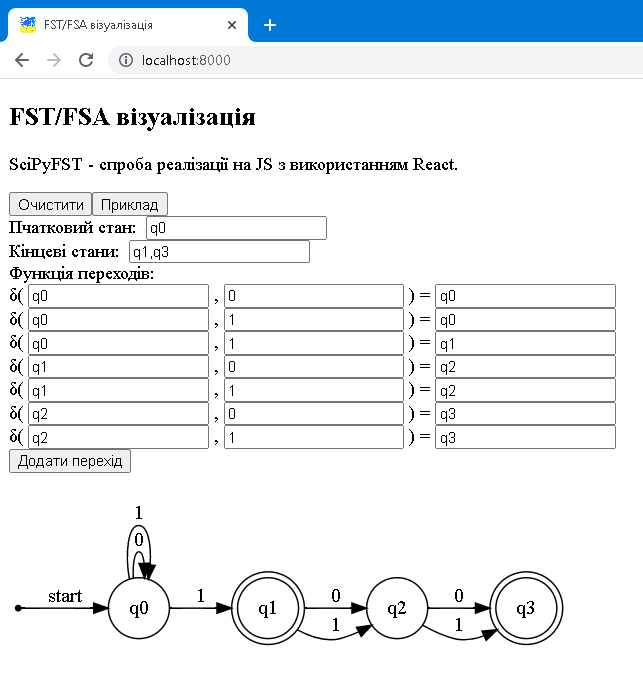

## Простий web-застосунок з використанням бібліотеки React
Застосунок розроблено в рамках виконання _Лабораторна робота 5. React Application_.
## Демонстрація роботи
Для демонстрації роботи застосунку необхідно запустити веб-сервер у головному каталозі проекту.<br>Наприклад:
```
python -m http.server 8000
```
## Приклад роботи застосунку

